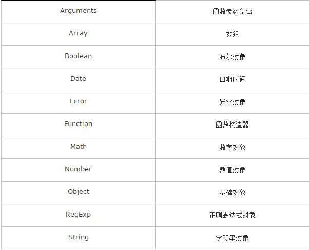

### 20-3-12

------

**刷题总结**

- 

1. parseFloat 解析一个字符串,并返回一个浮点数;
2. toFixed把数字转换成字符串,结果的小数点后有指定位数的数字;
3. Math.round把一个十字舍入为最接近的整数;
4. toPrecision把数字格式化为指定的长度;

- 函数的优先级

  https://developer.mozilla.org/en-US/docs/Web/JavaScript/Reference/Operators/Operator_Precedence

- 在HTML中嵌入PHP代码方式

  1. 默认语法<?php...?>

  2. 短标记<?...?>

  3. 脚本

  4. asp风格<%...%>

     

- js中的内置对象

  

- css定位
  1. static 定位
     HTML 元素的默认值，即没有定位，遵循正常的文档流对象。静态定位的元素不会受到 top, bottom, left, right影响。
  2. fixed 定位
     元素的位置相对于浏览器窗口是固定位置。即使窗口是滚动的它也不会移动;
  3. relative 定位
     相对定位元素的定位是相对其正常位置;
  4. absolute 定位
     绝对定位的元素的位置相对于最近的已定位父元素，如果元素没有已定位的父元素，那么它的位置相对于<html>;bsolute 定位使元素的位置与文档流无关，因此不占据空间。absolute 定位的元素和其他元素重叠。
  5. sticky 定位
     sticky 英文字面意思是粘，粘贴，所以可以把它称之为粘性定位。position: sticky; 基于用户的滚动位置来定位。粘性定位的元素是依赖于用户的滚动，在 position:relative 与 position:fixed 定位之间切换。它的行为就像 position:relative; 而当页面滚动超出目标区域时，它的表现就像 position:fixed;，它会固定在目标位置。
  6. 元素定位表现为在跨越特定阈值前为相对定位，之后为固定定位。这个特定阈值指的是 top, right, bottom 或 left 之一，换言之，指定 top, right, bottom 或 left 四个阈值其中之一，才可使粘性定位生效。否则其行为与相对定位相同

- html5 新增规范

  `sessionStorage , localSrorage , websocket`

- js中的事件模型

   https://www.cnblogs.com/leftJS/p/10948138.html 

  1. 原始事件: 所有浏览器都支持,没有事件流,不推荐使用;

  2. DOM2事件模型:w3c 制定,包含三个过程:

     - 事件捕获阶段
     - 事件目标阶段
     - 事件冒泡阶段

     > 事件的传播是可以阻止的

     - 在w3c中,使用 ` stopPropagation（） `方法
     - 在IE下设置 `eve.cancelBubble = true`;
     -  在捕获的过程中`stopPropagation（）`后，后面的冒泡过程就不会发生了 

     > 标准的事件监听器该如何绑定

     - `addEventListen("eventType","handler","true|false")` 第一个参数指事件类型,第二个参数是处理函数,第三个用来指定是否在捕获阶段进行处理,一般设为false与IE保持一致(默认),监听器的接触也类似 ` removeEventListner("eventType","handler","true!false") `;

  3. IE事件模型: 只有IE系列浏览器才可以这样写

  > 事件委托
  >
  >  适合用事件委托的事件：click，mousedown，mouseup，keydown，keyup，keypress。 