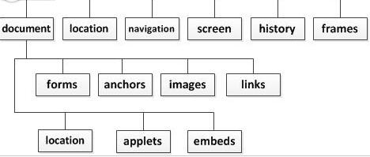
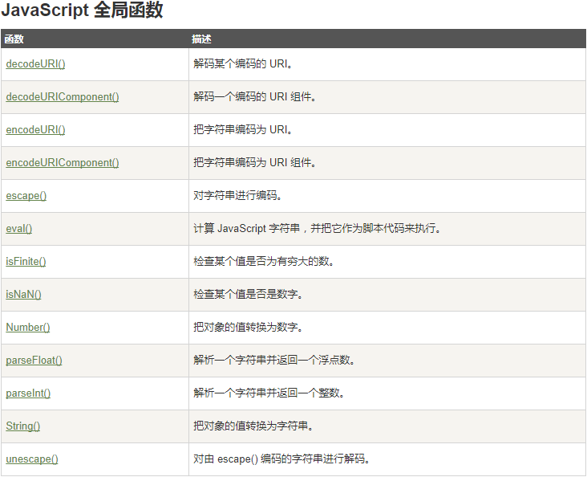
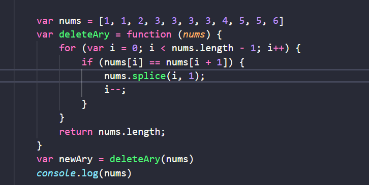
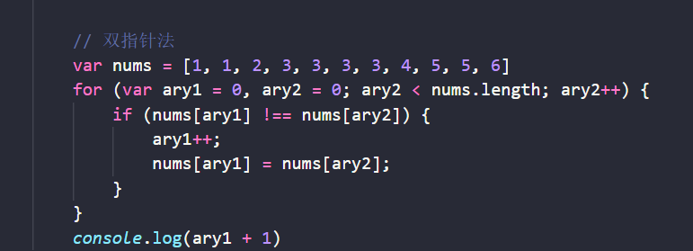

### 20-3-22

------

**刷题**

1. 主流浏览器内核私有属性css前缀：

   - mozilla内核（Firefox，flock等）   -moz
   - webkit内核（Safari，chrome）   -webkit
   - opera内核（Opera浏览器）   -o
   - trident内核（ie浏览器）    -ms

2. 要运用css3动画，需要运用@keyframes规则和animation属性

3. 在angular.js中

   - compile（绑定dom）
   - link（数据绑定）

4. 哪种js中字符串连接方式更高级

   - 旧浏览器（ie7-）下用join()会更高效，因为+的处理机制是：

   - 新建一个临时字符串，将新字符串赋值为a+b，然后返回这个临时的新字符串并同时销毁原始字符串，所以字符串连接效率低；
   - 新版浏览器效率差不多，除了做变量缓存外不需要做别的优化；

5. window对象的属性：

   

6. css中属性继承：

   - 所有元素可继承：visibility  和 cursor(光标属性)

   - 常见可继承：font-size、color、font-family、text-indent 、text-align...
   - 不可继承： border 、 margin、  padding、  display、background、height、width、overflow、position、left(等)、z-index、vertical-align...

7. DHTML:

   - 是动态性更强的网页

8. JavaScript的全局函数：

   

9. 关于css3  calc()方法

   - calc是css3新增的一个功能，用来指定元素的长度，还可以用在流式布局上，可以通过calc()计算得到元素的宽度
   - 可以给一个div,使用百分比、em、px、和rem单位值计算出其宽度或高度，比如：width：calc(50% + 2em)   ,就可以直接计算出；
   - 运算符前后加空格；
   - 兼容性，在使用时需要加上标识符,移动端的浏览器不兼容
   - ` .elm {
     	/*Firefox*/
       	-moz-calc(expression);
       	/*chrome safari*/
       	-webkit-calc(expression);
       	/*Standard */
       	calc();
      }`

    

   **算法题**

   1.     给定数组 nums = [1,1,2], 函数应该返回新的长度 2, 并且原数组 nums 的前两个元素被修改为 1, 2。 

   

   

