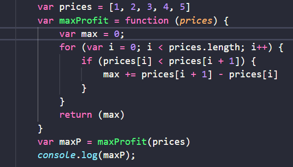
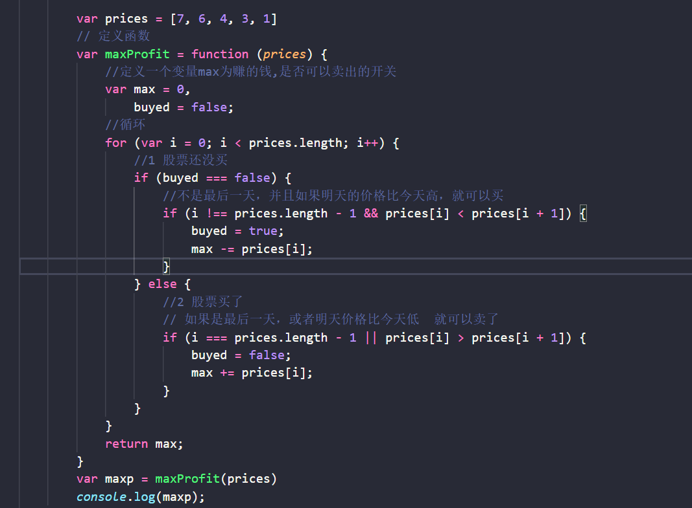
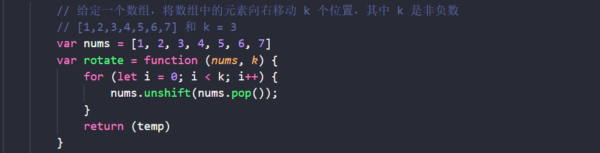

### 20-3-23

------

**算法题**

1.  给定一个数组，它的第 i 个元素是一支给定股票第 i 天的价格。设计一个算法来计算你所能获取的最大利润。你可以尽可能地完成更多的交易（多次买卖一支股票）注意：你不能同时参与多笔交易（你必须在再次购买前出售掉之前的股票）；

**示例 1:**

```
输入: [7,1,5,3,6,4]
输出: 7
解释: 在第 2 天（股票价格 = 1）的时候买入，在第 3 天（股票价格 = 5）的时候卖出, 这笔交易所能获得利润 = 5-1 = 4 。
     随后，在第 4 天（股票价格 = 3）的时候买入，在第 5 天（股票价格 = 6）的时候卖出, 这笔交易所能获得利润 = 6-3 = 3 。
```

方法一：



方法二：




1.  给定一个数组，将数组中的元素向右移动 *k* 个位置，其中 *k* 是非负数。

   示例1： 

   ```
   输入: [1,2,3,4,5,6,7] 和 k = 3
   输出: [5,6,7,1,2,3,4]
   解释:
   向右旋转 1 步: [7,1,2,3,4,5,6]
   向右旋转 2 步: [6,7,1,2,3,4,5]
   向右旋转 3 步: [5,6,7,1,2,3,4]
   ```



