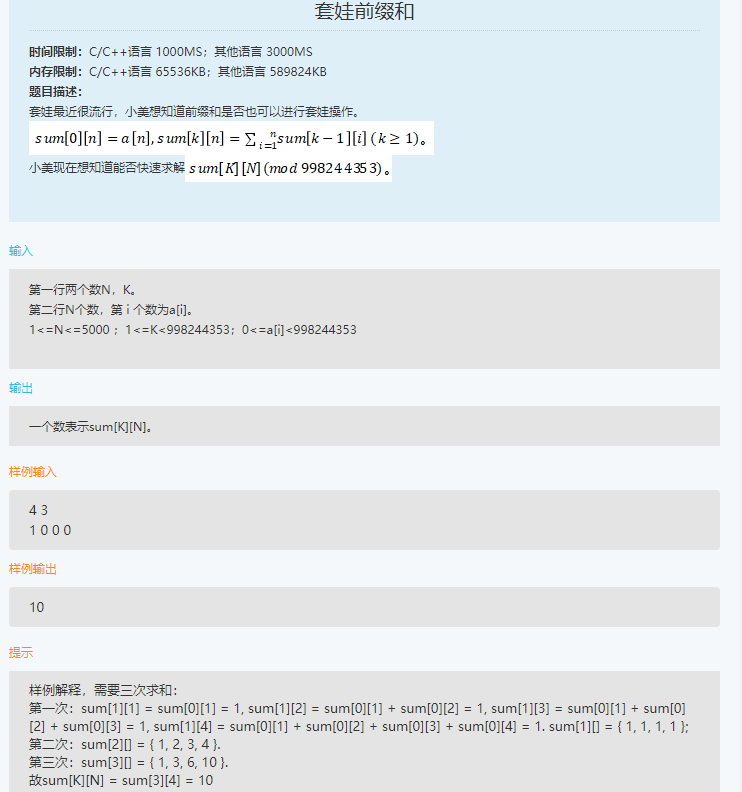
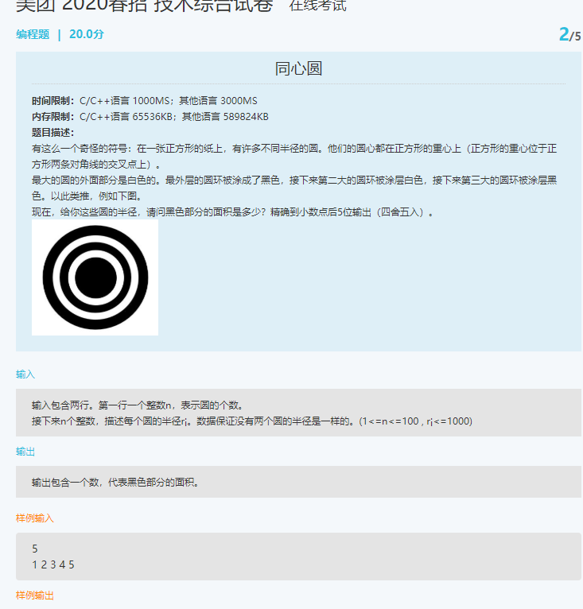
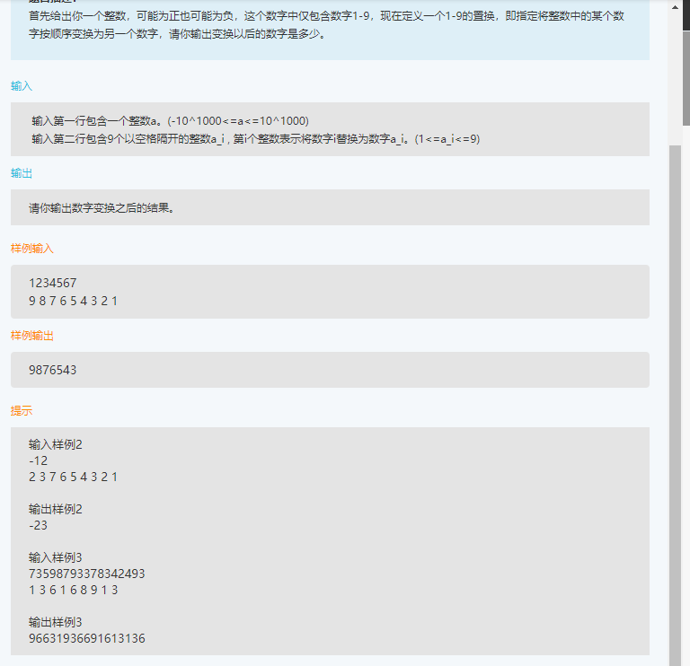
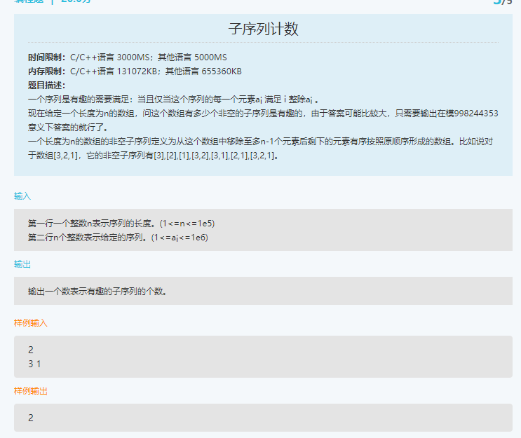
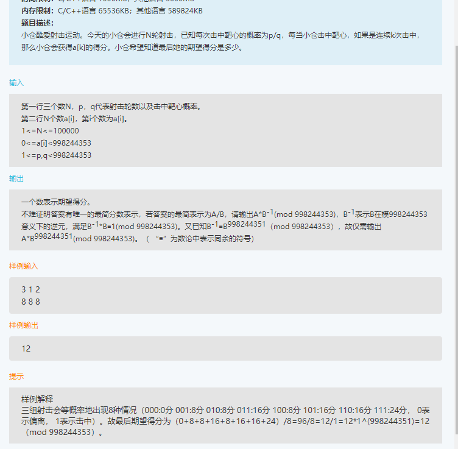

**美团面试题**

1. less与sass

   - less与sass都是css预编译器，对css赋予了动态语言的特性；
   - sass的安装需要Ruby环境，是在服务器端处理的，而less是需要引入less.js来处理less代码比输出css到浏览器；
   - less的变量符是@  sass的变量符是$
   - less不支持条件控制语句

2.  　相邻的两个div的外边距会重合（只用上下的div会重合，如果将连个div变成行内元素，那么他们相邻时不会出现外边距重合现象）
   　两个或多个块级盒子的垂直相邻边界会重合。结果的边界宽度是相邻边界宽度中最大的值。 

3. “超链接样式被点击过后a:hover{}和a:active{}样式不起作用”的原因及解决方法：

   - 可以通过改变css属性的排列顺序解决

   - `a:link {}`

     `a:visited {}`

     `a:hover {}`

     `a:active {}`

4. 关于js异常说法

   - try...catch必须成对出现
   - catch语句在try代码块发生错误时执行
   - throw抛出异常信息
   - throws声明可能出现的异常

5. 关于dom元素的 getelementbyname()方法：

   - 返回对拥有指定name值的对象引用
   - 返回的是一组对象

6. 数据库的一级、二级、三级封锁协议：

   - mysql的锁系统：共享锁和排他锁，也读读锁和写锁；

     - 读锁是共享的，或者说是互相不阻塞的，S锁；

     - 写锁是排他的，一个写锁会阻塞其他的写锁和读锁，X锁；

   - 在运行X锁和S锁对数据对象加锁时，还需要约定一些规则，例如合适申请X锁或S锁、持锁时间、何时释放等。称这些规则为封锁协议。

     - 一级封锁协议

       > 定义：事务T在修改数据R之前必须先对其加X锁，直到事务结束才释放。事务结束包括正常结束（COMMIT）和非正常结束 （ROLLBACK）。

       > 一级封锁协议可以防止丢失修改，并保证事务T是可恢复的。使用一级封锁协议可以解决丢失修改问题；

       > 在一级封锁中，如果仅仅是读数据不对其修改，是不需要加锁的，它不能保证可重复读和不读“脏”数据。

     - 二级封锁协议

       > 二级封锁协议是：一级封锁协议加上事务T在读取数据R之前必须先对其加S锁，读完后方可释放S锁；

       > 二级封锁协议除了防止了丢失修改，还可以进一步防止读“脏”数据。但在二级封锁协议中，由于读完数据后即可释放S锁，所以它不能保证可重复性。

     - 三级封锁协议

       > 定义：一级封锁协议加上事务T在读取数据R之前必须先对其加S锁，直到事务结束才释放

       > 三级封锁协议除了防止丢失修改和不读“脏”数据外，还进一步防止了不可重复读

   **美团技术综合试题**

   题目：

   

   

