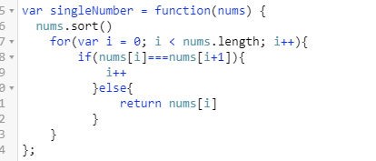

**算法题**

1. 给定一个整数数组，判断是否存在重复元素。如果任何值在数组中出现至少两次，函数返回 true。如果数组中每个元素都不相同，则返回 false。

   **示例 1:**

   ```
   输入: [1,2,3,1]
   输出: true
   ```

​       解答：


2. 给定一个**非空**整数数组，除了某个元素只出现一次以外，其余每个元素均出现两次。找出那个只出现了一次的元素。 

   **示例 1:**

   ```
   输入: [2,2,1]
   输出: 1
   ```

​       解答：

​       


**刷题**

1. 关于类
   - 类方法是指用static修饰的方法，普通方法叫对象方法；
   - this指的是当前对象，类方法依附于类而不是对象this会编译出错
   - 类方法中也可以调用其他类的类方法
   - 类方法中可以创建对象，所以可以调用实例方法
2. 数据链路层服务功能主要分为以下三类：面向连接确认服务、无连接确认服务、无连接不确认服务
3. 重载：
   - 基本条件：
     - 函数名必须相同；
     - 函数参数必定不相同，可以是参数类型或参数个数不同；
     - 函数返回值可以相同，也可以不相同