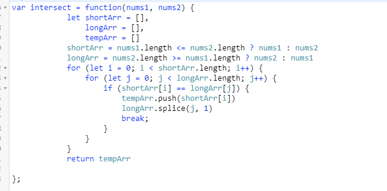
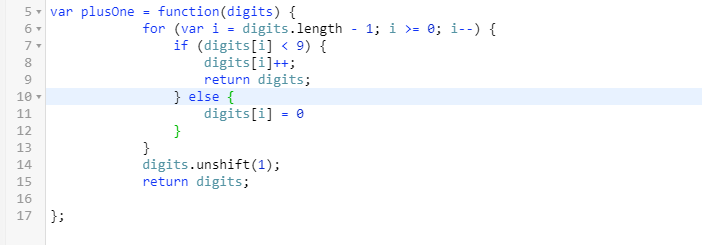

**算法题**

1.  给定两个数组，编写一个函数来计算它们的交集。 

   **示例 1:**

   ```
   输入: nums1 = [1,2,2,1], nums2 = [2,2]
   输出: [2,2]
   ```

   解答:



2. 给定一个由**整数**组成的**非空**数组所表示的非负整数，在该数的基础上加一。最高位数 字存放在数组的首位， 数组中每个元素只存储**单个**数字。你可以假设除了整数 0 之 外，这个整数不会以零开头。

   **示例 1:**

   ```
   输入: [1,2,3]
   输出: [1,2,4]
   解释: 输入数组表示数字 123。
   ```

   解答：

   


**知识点**

1. localstorages

   - 写入字段：
     - localstorage["a"] = 1
     - localstorage.b =1
     - localstorage.setItem("c",3)
   - 读取字段
     - var a=localstorage.a
     - var b=localstorage["b"]
     - var c=localstorage.getItem("c")

2. 与浏览列表有关的对象：

   - history、screen、location、navigator

3. 几个常见的事件的方法：

   - preventDefult() 取消事件默认行为，如阻止点击提交时对表单的提交
   - stoplmmediatePropagation() 取消事件冒泡同时阻止当前节点上的事件处理程序被调用，影响当前事件触发
   - stopPropagation() 取消事件冒泡
   - returnValue()    取消事件默认行为

4. 关于js系统方法：

   - parseFloat :将字符串转换为对应的小数
   - escape：该方法返回对一个字符编码后的结果字符串
   - eval: 返回字符串表达式中的值
   - unEscape：返回字符串ASCI码

5. | 超小屏幕（手机） | 小屏幕（平板） | 中等屏幕（桌面） | 大屏幕（桌面） |
   | ---------------- | -------------- | ---------------- | -------------- |
   | <768px           | >=768          | >=992            | >=1200         |
   | .col-xs-         | .col-sm-       | .col-md-         | .col-lg-       |

6. 触摸事件：

   - touchesStart
   - touchMove
   - touchCancel
   - touchEnd
   - 每个触摸事件被触发后，会生成一个event对象，event对象里额外包括以下三个触摸对象
     - touches:   当前屏幕上所有手指的列表 
     - targetTouches :  当前dom元素上手指的列表，尽量使用这个代替touches 
     - changedTouches :  涉及当前事件的手指的列表，尽量使用这个代替touches 

7. 常见的不支持冒泡事件：

   - focus
   - blur
   - mouseenter
   - mouseleave
   - load
   - unload
   - resize

8. H5新的表单元素：

   - datalist
   - keygen
   - output

   

   

   