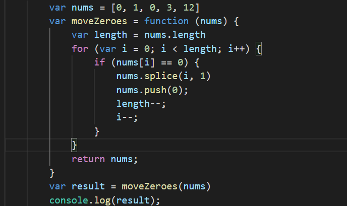
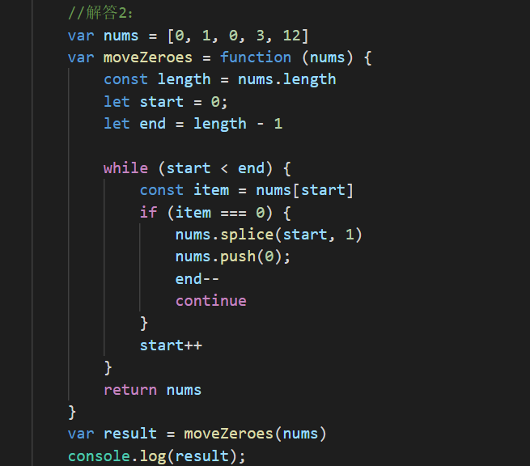
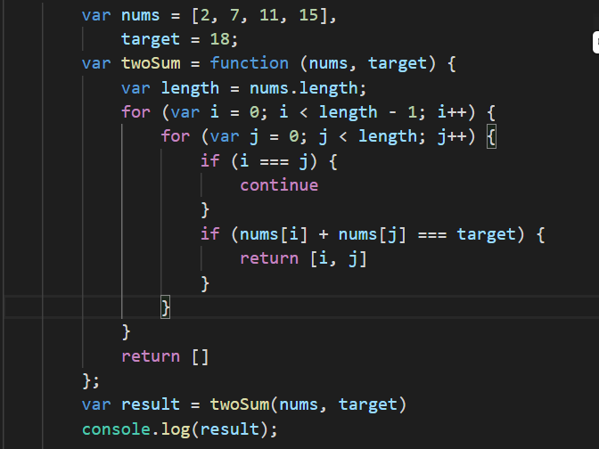
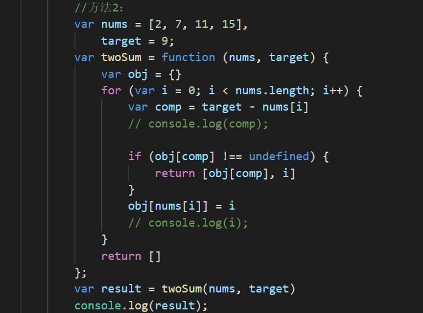

### 20-3-29

------

**算法题**

1. ***移动零***

   给定一个数组 `nums`，编写一个函数将所有 `0` 移动到数组的末尾，同时保持非零元素的相对顺序。

   **示例:**

   ```
   输入: [0,1,0,3,12]
   输出: [1,3,12,0,0]
   ```

   解答1：

   

   解答2：

   


2. ***两数之和***

   给定一个整数数组 `nums` 和一个目标值 `target`，请你在该数组中找出和为目标值的那 **两个** 整数，并返回他们的数组下标。

   你可以假设每种输入只会对应一个答案。但是，你不能重复利用这个数组中同样的元素。

   **示例:**

   ```
   给定 nums = [2, 7, 11, 15], target = 9
   
   因为 nums[0] + nums[1] = 2 + 7 = 9
   所以返回 [0, 1]
   ```

   方法一：

   

   方法二：

   


**刷题**

1. DNS协议：

   - DNS就是将域名翻译成IP地址

   - DNS协议主要运行在UDP上，但是请求字节超过512字节时用TCP协议，将其分割成多个片段传输

   - DNS协议默认端口号是53

   - 操作系统的DNS缓存： windows DNS缓存的默认值是 MaxCacheTTL，它的默认值是86400s，也就是一天 ， macOS 严格遵循DNS协议中的TTL。 

     浏览器的DNS缓存： chrome对每个域名会默认缓存60s；IE将DNS缓存30min；Firefox默认缓存时间只有1分钟；Safari约为10S 

2. 关于闭包

   -  闭包变量执行后不会被清楚
   - （function() {}）()理论上是一个闭包

4. 关于animation-timing-function

   - | 属性                  | 描述                                                         |
     | :-------------------- | :----------------------------------------------------------- |
     | linear                | 动画从头到尾的速度是相同的。                                 |
     | ease 默认             | 动画以低速开始，然后加快，在结束前变慢。                     |
     | ease-in               | 动画以低速开始。                                             |
     | ease-out              | 动画以低速结束。                                             |
     | ease-in-out           | 动画以低速开始和结束。                                       |
     | cubic-bezier(n,n,n,n) | 在 cubic-bezier 函数中自己的值。可能的值是从 0 到 1 的数值。 |


