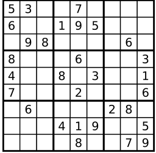

### 20-3-30

------

**算法题**

1. ***有效数独***

   判断一个 9x9 的数独是否有效。只需要**根据以下规则**，验证已经填入的数字是否有效即可。

   1. 数字 `1-9` 在每一行只能出现一次。
   2. 数字 `1-9` 在每一列只能出现一次。
   3. 数字 `1-9` 在每一个以粗实线分隔的 `3x3` 宫内只能出现一次。

   

   上图是一个部分填充的有效的数独。

   数独部分空格内已填入了数字，空白格用 `'.'` 表示。

   **示例 1:**

   ```
   输入:
   [
     ["5","3",".",".","7",".",".",".","."],
     ["6",".",".","1","9","5",".",".","."],
     [".","9","8",".",".",".",".","6","."],
     ["8",".",".",".","6",".",".",".","3"],
     ["4",".",".","8",".","3",".",".","1"],
     ["7",".",".",".","2",".",".",".","6"],
     [".","6",".",".",".",".","2","8","."],
     [".",".",".","4","1","9",".",".","5"],
     [".",".",".",".","8",".",".","7","9"]
   ]
   输出: true
   ```

    解答：

**刷题**

1. 单元格边距(cellpadding)    代表单元格外面的一个距离，用于隔开单元格与单元格空间

   元格间距(cellspacing )     代表表格边框与单元格补白的距离，也是单元格补白之间的距离

2. 关于符号所表示的意义：

   -  *:  出现零到多次
   -  +：出现一次到多次
   - ？：出现零次或者一次
   - . :除了\n以外的任意字符
   -  {n} : 出现n次 
   -  {n,} : 出现n到多次 
   -  {n,m} : 出现n到m次 
   -  var reg=/^0.2$/; //以0开头，以2结尾，中间可以是\n以外的任意字符 

3.  flash和js通过什么类如何交互 

   - flash提供了Externallnterface接口与JavaScript通信，他有两个方法，call与addCallback，call的作用是让flash调用js里的方法，addCallback是用来注册flash函数让js调用

4. iframe

   - 创建比一般的dom元素慢了1~2个数量级
   - 阻塞页面加载
   - 唯一的连接池：浏览器只能开少量的连接到web服务器
   - 不利于SEO： 搜索引擎的检索程序无法解读 iframe。另外，iframe 本身不是动态语言，样式和脚本都需要额外导入 

5. ```
   var foo = {n:1};
   (function(foo){      ``//形参foo同实参foo一样指向同一片内存空间，这个空间里的n的值为1
     var foo;        ``//优先级低于形参，无效。
     console.log(foo.n);  ``//输出1
     foo.n = 3;       ``//形参与实参foo指向的内存空间里的n的值被改为3
     foo = {n:2};      ``//形参foo指向了新的内存空间，里面n的值为2.
     console.log(foo.n);  ``//输出新的内存空间的n的值
   })(foo);
   console.log(foo.n);    ``//实参foo的指向还是原来的内存空间，里面的n的值为3.
   ```

