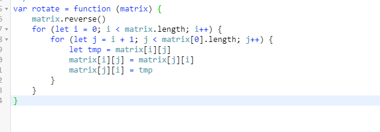

### 20-3-31

------

**算法题**

1.  ***旋转图像***

   给定一个 *n* × *n* 的二维矩阵表示一个图像。

   将图像顺时针旋转 90 度。

   **说明：**

   你必须在**[原地](https://baike.baidu.com/item/原地算法)**旋转图像，这意味着你需要直接修改输入的二维矩阵。**请不要**使用另一个矩阵来旋转图像。

   **示例 1:**

   ```
   给定 matrix = 
   [
     [1,2,3],
     [4,5,6],
     [7,8,9]
   ],
   
   原地旋转输入矩阵，使其变为:
   [
     [7,4,1],
     [8,5,2],
     [9,6,3]
   ]
   ```

   解答：

   **刷题**

   1. css设置文字超出部分显示...的属性

      - white-space: nowrap;
      - text-overflow:ellipsis;

   2. 两个图片之间间隙怎么解决：

      - img{ display:block};（消除上下间隙）
      -  img{vertical-align:top;}（消除上下间隙） 
      -  div{ line-height:0 };（消除上下间隙） 
      -   多个标签写在一行（消除左右间隙） 
      -  使用letter-spacing属性（消除左右间隙） 
      -  img{float: left;}（消除上下左右间隙 )
      -  div{font-size:0};（消除上下左右间隙 )

   3. v-if与v-for 

      -  当 v-if 与 v-for 一起使用时，v-for 具有比 v-if 更高的优先级 
      - 不要把v-if和v-for 用在同一个元素上

   4. this.$nextTick():

      该方法主要是用在随数据改变而改变的dom应用场景 , vue中数据和dom渲染由于是异步的，所以，要让dom结构随数据改变这样的操作都应该放进它的回调函数中 ；
      this.$emit是子组件向父组件传值

   5. $attrs:
     是v-bind的属性，将父组件中不被认为props特性绑定的属性传入子组件中；

     $listeners:

     它是一个对象，里面包含了作用在这个组件上所有的监听事件，可以通过 v-on="$listeners" 将事件监听指向这个组件内的子元素。

   6. symbol的用法 

      - symbol值通过symbol函数生成，也就是说，对象的属性名现在可以有两种类型，一种是原来就有的字符串，另一种就是新增的symbol类型，凡是属性名属于symbol类型，就都是独一无二的，可以保证不会与其他属性名产生冲突
      - symbol函数前不能使用new关键字，会报错，因为symbol是原始数据类型，而不是对象，所以不能添加属性
      - symbol可以接受一个字符串作为参数，表示对symbol的描述，主要是在控制台显示时为了区分，无论有没有参数两个symbol都是不相等的；
      - symbol不能与其他的值进行运算，否则会报错
      - symbol可以显示的转换为字符串，布尔值，但不能转为数字
      -  Symbol值作为对象的属性名时不能使用点运算符，同理，在对象的内部使用Symbol值时也必须放在方括号中 
      -  Symbol还可以定义一组常量，保证这组常量的值都是不相等的 

   7.  Object.assign()方法 

      - ```
        Object.assign(target, ...sources)
        ```

      - 用于对象的合并，将源对象(source)的所有可枚举属性，复制到目标对象(target)
      - 它至少需要两个对象作为参数，第一个参数是目标对象，后面的参数都是源对象。只要有一个参数不是对象，就会抛出TypeError错
      - 用途：
        - 合并多个对象
        - 克隆对象
        - 更改属性的值

   8.  将集合A转化为数组 

      - Array.from(arr, mapfn,thisArg)方法，用于将两类可以把对象转换为真正的数组：类似数组的对象和可遍历的对象（部署了Iterator接口的，String，ES6新增的Map和Set）。可以传3个参数，其中第一个是数组，必传；第二个是一个函数（类似map函数），对数组元素进行操作后再返回数组，可选；第三个是对于this关键字的指向，可选。
      - slice() 方法可从已有的数组中返回选定的元素。
        返回值：返回一个新的数组，包含从 start 到 end （不包括该元素）的 arrayObject 中的元素。
        说明
        请注意，该方法并不会修改数组，而是返回一个子数组。如果想删除数组中的一段元素，应该使用方法 Array.splice()。
        所以在这里就是对集合A应用slice，返回一个新的数组，不对数组做任何改变。
      - 展开运算符，把A集合的元素展开后，用数组[]承载，返回新的数组。
      - map() 方法返回一个新数组，数组中的元素为原始数组元素调用函数处理后的值。
        map() 方法按照原始数组元素顺序依次处理元素。
        注意： map() 不会对空数组进行检测。
        注意： map() 不会改变原始数组。
        所以map方法返回了一个新的数组，并且数组中每个元素是A里面的元素

   