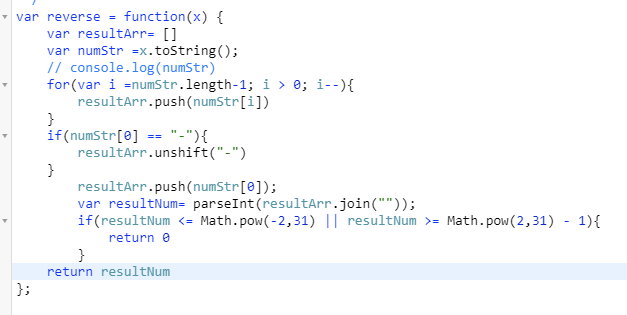

### 20-4-1

------

**算法题**

1. 反转字符串

   编写一个函数，其作用是将输入的字符串反转过来。输入字符串以字符数组 `char[]` 的形式给出。

   不要给另外的数组分配额外的空间，你必须**[原地](https://baike.baidu.com/item/原地算法)修改输入数组**、使用 O(1) 的额外空间解决这一问题。

   你可以假设数组中的所有字符都是 [ASCII](https://baike.baidu.com/item/ASCII) 码表中的可打印字符。 

   **示例 1：**

   ```
   输入：["h","e","l","l","o"]
   输出：["o","l","l","e","h"]
   
   ```

   

2. 整数反转

   给出一个 32 位的有符号整数，你需要将这个整数中每位上的数字进行反转。

   **示例 1:**

   ```
   输入: 123
   输出: 321
   ```

    **示例 2:**

   ```
   输入: -123
   输出: -321
   ```

   解答：

   