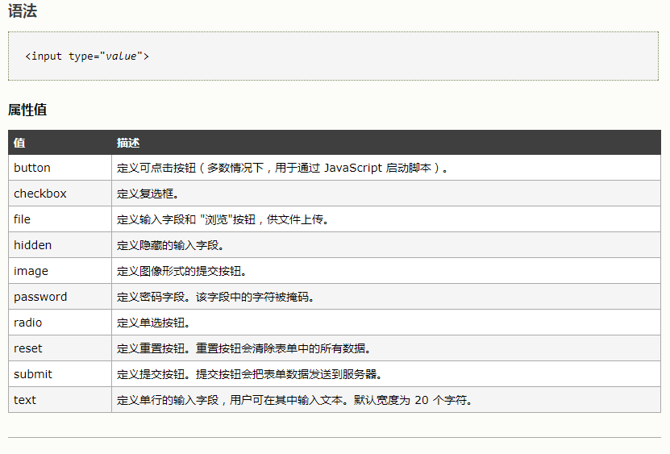

##### 刷题

------

1. **jQuery中方法**

   -  **append(content)方法**

   方法作用：**向每个匹配的元素内部追加内容。**

   参数介绍：content (<Content>): 要追加到目标中的内容。

   用法示例：

   HTML代码为<p>I like </p><p>I love</p>

   向所有p标签中追加一个单词china，则写法为 $("p").append("china");

   结果为：<p>I like china</p><p>I love china </p>

   - **appendTo(expr)方法**

   方法作用：**把所有匹配的元素追加到指定的元素集合中。**

   参数介绍：expr (String): 用于匹配元素的jQuery表达式。

   用法示例：

   HTML代码为<b>I love china </b><p></p>

   把标签b追加到p元素中，写法为$("b").appendTo("p");

   结果为：><p><b>I love china </b></p>

   使用appendTo这个方法是颠倒了常规的$(A).append(B)的操作，即不是把B追加到A中，而是把A追加到B中。

2.  

   -  window.history.forward(1) ， window.history.forward(-1)

     当用户打开一个网页时，想一直停留在当前打开的页面，禁止页面前进和后退 

   -  window.history.back(1) 

      history.back() 方法加载历史列表中前一个 URL。 这等同于在浏览器中点击后退按钮。 

   -  window.history.go() 

     你可以用 go() 方法载入到会话历史中的某一特定页面， 通过与当前页面相对位置来标志 (当前页面的相对位置标志为0).  

        向后移动一个页面 (等同于调用 back()):  

     ```
     window.history.go(-1);
     ```

        向前移动一个页面, 等同于调用了 forward():  

     ```
     window.history.go(1);
     ```

1.    type属性值

   

2. html5中可以省略结束标记的元素有这些：

   dd 、dt、 li、p、optgroup、option、rt、rp、thread、tfoot、tr、td、th

3. 常见的行块级元素(拥有内在尺寸，**可设置高宽，不会自动换行** )有：

      (button,input，textarea,select), img

4. 